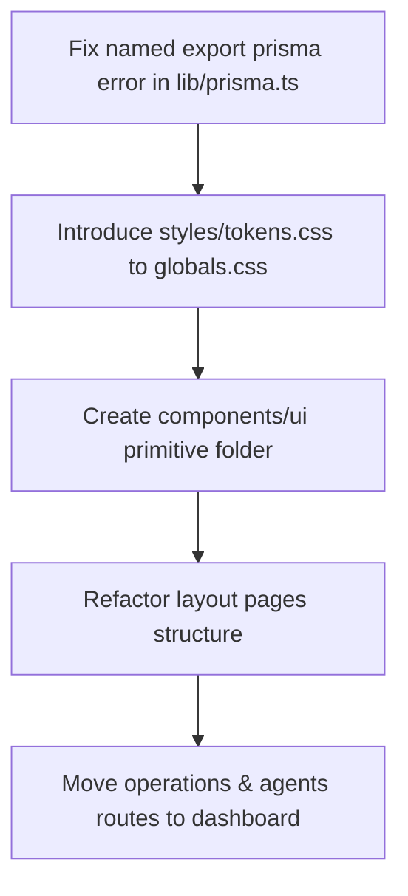

# Organics by Awan Farms - Premium UI/UX Visual Design Concept

This document details the high-fidelity UI/UX design concept, brand strategy, design system tokens, layout structures, and motion guidelines for the **Organics by Awan Farms – Agentic AI Dairy Farm Management System**. 

---

## 1. Visual Brand Design System

To position Organics by Awan Farms as a luxury, high-end organic dairy brand, we establish a design system utilizing rich farm green, warm heritage gold, and milk cream tones.

### Color Palette (HSL & Hex)

| Token Name | Hex Code | HSL Representation | Application |
| :--- | :--- | :--- | :--- |
| **Forest Grass (Primary)** | `#0F4D23` | `hsl(141, 67%, 18%)` | Brand signature, major actions, navigation, dark headings |
| **Meadow Cream (Background)** | `#F7F3E8` | `hsl(43, 41%, 94%)` | Primary background canvas (soft, non-clinical base) |
| **Wheat Gold (Accent)** | `#C89F41` | `hsl(41, 56%, 52%)` | Premium sub-headings, gold badges, luxury highlights |
| **Fresh Leaf (Highlight)** | `#4ADE80` | `hsl(142, 70%, 58%)` | Status tags (Active/Paid), positive alerts, AI badge |
| **Velvet Ink (Typography)** | `#16331F` | `hsl(140, 39%, 14%)` | Standard body copy, dense high-contrast readable text |
| **Surface Glass** | `#FFFFFF` | `rgba(255, 255, 255, 0.75)` | Glassmorphism cards with `backdrop-filter: blur(16px)` |

### Typography Scale (Google Fonts: Outfit & Inter)

*   **Display Header (Hero)**: `Outfit` (Bold / 900) - Large, clean geometric shapes with rounded details.
*   **Body Copy & Metrics**: `Inter` (Regular / Medium) - Highly legible pixel layouts optimized for data lists and mobile screen reading.

---

## 2. Screen-by-Screen Layout Concepts

Below are the visual wireframe layouts for the four core system portals, designed for desktop and mobile responsiveness.

### Screen 1: Public Landing Page (Desktop)

A luxury boutique storefront greeting buyers with pure farm visuals and straightforward conversion paths.

```
+--------------------------------------------------------------------------+
|  [Logo] Organics by Awan Farms        Products   Promise   Plans   [Login] |
+--------------------------------------------------------------------------+
|                                                                          |
|       Pure Milk. Pure Promise.                                [Bottle]   |
|       Fresh cow and buffalo milk delivered                    [Pasture   |
|       daily from our Lahore pasture.                          [Hero      |
|                                                                Graphic]  |
|       [ Build Your Subscription ] <--- Gold Accent CTA                   |
|                                                                          |
+--------------------------------------------------------------------------+
|  [Select Your Plan]                                                      |
|  +---------------------------------+  +-------------------------------+  |
|  |  Cow Milk                       |  |  Buffalo Milk                 |  |
|  |  PKR 330 / Liter                |  |  PKR 430 / Liter              |  |
|  |  [ - ] 2 Liters [ + ]           |  |  [ - ] 1 Liter [ + ]          |  |
|  |  (Daily / Alternate / Weekend)  |  |  (Daily / Alternate / Weekend) |  |
|  |  [ Subscribe Now ]              |  |  [ Subscribe Now ]            |  |
|  +---------------------------------+  +-------------------------------+  |
+--------------------------------------------------------------------------+
|  [Our Quality Promise]                                                   |
|  (Icon: Pasture) 100% Raw & Fresh  | (Icon: Truck) Daily Morning Delivery|
|  (Icon: Shield) Clean Glass Bottle | (Icon: Leaf) Preservative-Free      |
+--------------------------------------------------------------------------+
|  [Active Delivery Routes - Lahore]                                       |
|  [Model Town] [Bahria] [Johar Town] [Cantt] [Gulberg] [Iqbal Town]       |
+--------------------------------------------------------------------------+
|  Need Custom Orders? [ Chat on WhatsApp +92 339-5235323 ]                |
+--------------------------------------------------------------------------+
```

---

### Screen 2: Customer Self-Service Dashboard (Desktop)

A clean, premium workspace where customers manage their morning deliveries, vacation holds, and monthly accounts.

```
+--------------------------------------------------------------------------+
|  [Logo] Organics        Dashboard   My Plan   Payments   [Sarah J. (Icon)]|
+--------------------------------------------------------------------------+
|                                                                          |
|   Active Subscription               Billing & Receipts                   |
|   +------------------------------+  +---------------------------------+  |
|   | Daily Cow Milk - 2 Liters    |  | Unpaid Balance: PKR 19,800      |  |
|   | Rate: PKR 330 / L            |  | Billing Period: May 2026        |  |
|   | Status: [ ACTIVE (Green) ]   |  | Due Date: June 05, 2026         |  |
|   | Next Delivery: Tomorrow 7 AM |  | [ Pay Invoice Now ]             |  |
|   +------------------------------+  +---------------------------------+  |
|                                                                          |
|   Vacation Hold (Calendar)          Extra Milk Request                   |
|   +------------------------------+  +---------------------------------+  |
|   | Select Dates to Pause        |  | Need extra liters for tomorrow? |  |
|   | [ May 28, 2026 - Jun 02 ]    |  | Add liters: [ - ] 1 [ + ]       |  |
|   | [ Submit Pause Request ]     |  | [ Request Extra Liters ]        |  |
|   +------------------------------+  +---------------------------------+  |
|                                                                          |
+--------------------------------------------------------------------------+
|  [!] Delivery Alert: Rider is en route (Estimated Arrival: 07:15 AM)     |
+--------------------------------------------------------------------------+
|  [Floating Support Widget: Ask Support Agent (AI chat box UI)]           |
+--------------------------------------------------------------------------+
```

---

### Screen 3: Rider Mobile Dashboard (Mobile-First)

A high-contrast, swipe-friendly, simplified list optimized for early-morning operations.

```
+-----------------------------------------+
|  [Icon] Route Dispatch     [Rider: Ali] |
+-----------------------------------------+
|  Route: Model Town Block E & F          |
|  Total volume: 42 Liters (26 Cow, 16 Buf)|
|  [ Optimize Dispatch Queue ]            |
+-----------------------------------------+
|  #1. House 69-E, Model Town             |
|  Qty: 4 Liters [Cow Milk]               |
|  Payment: [ PAID (Cash) ]               |
|  Notes: Leave bottle outside main gate  |
|  [ Call ]  [ WhatsApp ]                 |
|  [ Mark Delivered ]   [ Mark Missed ]   |
+-----------------------------------------+
|  #2. House 112-F, Model Town            |
|  Qty: 2 Liters [Buffalo Milk]           |
|  Payment: [ PENDING PKR 860 ]           |
|  Notes: Ring bell twice                 |
|  [ Call ]  [ WhatsApp ]                 |
|  [ Mark Delivered ]   [ Mark Missed ]   |
+-----------------------------------------+
|  [🎤 Speak to Dispatch Assistant AI ]   |
+-----------------------------------------+
```

---

### Screen 4: Admin Executive Dashboard (Desktop ERP)

An executive dashboard highlighting critical operations, route logistics, AI-detected ledger contradictions, and cash collection totals.

```
+--------------------------------------------------------------------------+
| [Logo] ERP Control   Dashboard  Logistics  Expenses  AI Center  [S. Chen]|
+--------------------------------------------------------------------------+
|  KPI Overview                                                            |
|  +--------------+  +--------------+  +--------------+  +--------------+  |
|  | Today Liters |  | Active Subs  |  | Total Revenue|  | Outstanding  |  |
|  | 142 Liters   |  | 48 Homes     |  | PKR 136,800  |  | PKR 18,200   |  |
|  +--------------+  +--------------+  +--------------+  +--------------+  |
|                                                                          |
|  AI Audit Center                                                         |
|  +---------------------------------------------------------------------+ |
|  | [!] Exception Alert: Ledger mismatch detected on Customer #4521     | |
|  |     Status marked "Paid" but balance sheet shows outstanding PKR 850| |
|  |     [ Reconcile Balance ]   [ Run Auto Audit Check ]                | |
|  +---------------------------------------------------------------------+ |
|                                                                          |
|  Logistics & Route Dispatch         Rider Efficiency                     |
|  +--------------------------------+ +----------------------------------+ |
|  | Route A (Model Town): 48 Liters| | Ali: 22 deliveries / 0 missed    | |
|  | Route B (Bahria): 36 Liters    | | Bilal: 18 deliveries / 2 missed  | |
|  | [ Generate Route Dispatch ]    | | [ View Map Coordinates ]         | |
|  +--------------------------------+ +----------------------------------+ |
|                                                                          |
+--------------------------------------------------------------------------+
```

---

## 3. UI Component Style Guide

```
+------------------------------------------------------------------------+
|                                                                        |
|  BUTTONS:                                                              |
|  [ Primary Action ]       -->  Background: #0F4D23 (Forest Green)      |
|                                Text: #FFFFFF, Rounded: 8px (md)        |
|                                                                        |
|  [ Secondary / Accent ]   -->  Background: #F7F3E8 (Meadow Cream)      |
|                                Border: 1.5px solid #C89F41 (Gold)      |
|                                Text: #0F4D23, Rounded: 8px (md)        |
|                                                                        |
|  BADGES:                                                               |
|  [ Active ]               -->  Bg: #EBFEEF, Text: #15803D (Leaf Green) |
|  [ Unpaid ]               -->  Bg: #FEEFEE, Text: #B91C1C (Crimson)    |
|                                                                        |
|  CARDS:                                                                |
|  +----------------------+                                              |
|  |                      | -->  Background: rgba(255, 255, 255, 0.8)    |
|  |  Content Area        |      Backdrop Filter: blur(12px)             |
|  |                      |      Border: 1px solid rgba(15, 77, 35, 0.08)|
|  +----------------------+      Box Shadow: 0 4px 20px rgba(0,0,0,0.02) |
|                                                                        |
+------------------------------------------------------------------------+
```

---

## 4. Micro-Interactions & Animation Guide

To give the application a premium, alive feel, implement the following key interactions using `Framer Motion`:

1.  **Card Lift (Hover State)**:
    *   **Trigger**: Cursor hover on cow/buffalo product pricing cards or subscription grids.
    *   **Behavior**: Smooth translate-Y lift of `-4px` with box-shadow deepening from `rgba(0,0,0,0.02)` to `rgba(15,77,35,0.08)`.
2.  **Slide-Out AI Panel**:
    *   **Trigger**: Clicking the floating support badge or voice dispatch widget.
    *   **Behavior**: Side panel slides in from the right edge with a spring animation (`type: "spring", stiffness: 300, damping: 30`).
3.  **Active Status Pulse**:
    *   **Trigger**: Load state of "Active" tags on customer dashboards and "Synchronized" connection signals on the ERP system.
    *   **Behavior**: Continuous, subtle opacity pulse (between `0.7` and `1.0` every `2.5s`) of the status tag's glowing background circle.
4.  **Quantity Counter Pop**:
    *   **Trigger**: Clicking `[ + ]` or `[ - ]` to change delivery liters.
    *   **Behavior**: Small scale pop (`scale: [1, 1.15, 1]`) of the center digit to provide physical feedback to the user.

---

## 5. Safest First Step Implementation Blueprint

To move from design to code safely without breaking the current database, Prisma structure, or auth logic:



### Sprint 1: Resolve Build Blockers & Install Tokens
1.  **Named Export**: Modify `lib/prisma.ts` to expose `export const prisma = client;` directly.
2.  **Typography**: Import the Google Fonts `Outfit` and `Inter` via `@import` in `app/globals.css`.
3.  **Tokens**: Define CSS variables under `styles/tokens.css` for primary/secondary colors and border-radius rules.

### Sprint 2: Core Layout Scaffolding (No functionality logic change)
1.  **Organize Elements**: Categorize the flat `components/` list into the appropriate subfolders:
    *   `components/ui/` for buttons, cards, badges
    *   `components/layout/` for header, sidebar
    *   `components/agents/` for chat overlays
2.  **Move Pages**: Relocate `app/operations/page.tsx` and `app/agents/page.tsx` inside the proper nested `app/dashboard/` paths. Add Next.js middleware routing rules to prevent 404s.
